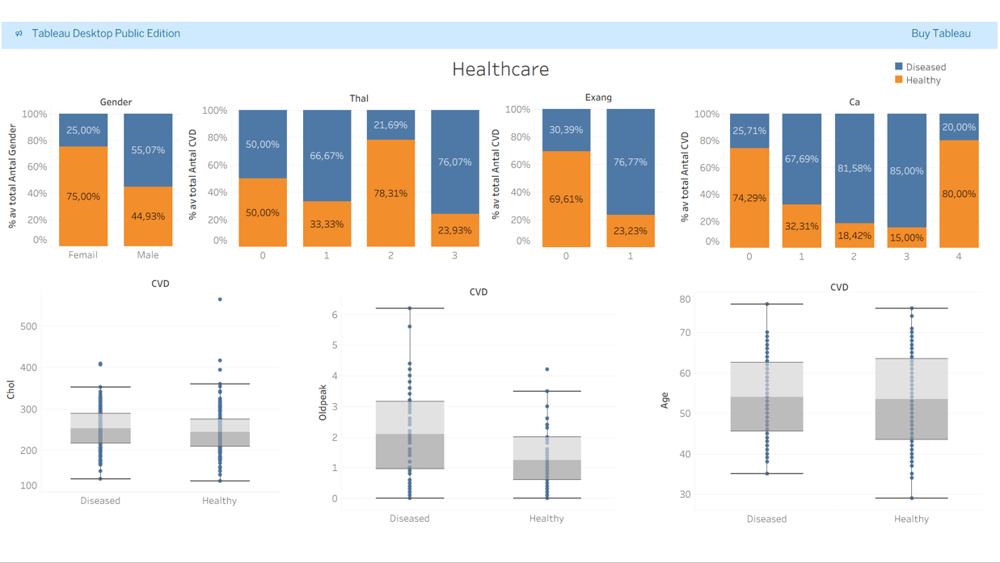
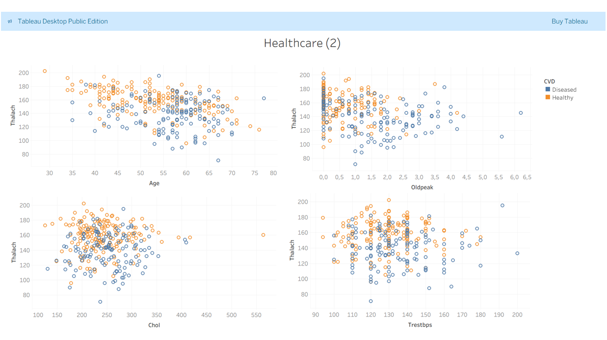

# Heart Disease Risk Analysis

This project analyzes clinical patient data to identify key risk factors associated with heart disease and support data-driven risk assessment..

## Objective

Identify key clinical factors associated with heart disease and build a baseline model to support risk classification.

## Approach

* Performed exploratory data analysis on patient clinical data
* Compared diseased vs healthy groups across key variables
* Built a baseline logistic regression model
* Visualized results using Tableau dashboards

## Key Findings

* Male patients show a higher proportion of heart disease
* Exercise-induced angina is strongly associated with disease presence
* Higher values of ca and oldpeak are linked to increased risk
* Diseased patients tend to have lower maximum heart rate
* Cholesterol alone is not a strong predictor

## Model Performance

* Logistic Regression baseline model  
* Achieved ~88.5% accuracy, providing a strong baseline for classification

## Visualization

Tableau dashboards are used to clearly compare diseased vs healthy patients 
and highlight key risk patterns across variables.

### Dashboard preview




## Dataset

The dataset contains 303 patient records and 14 attributes, including demographic and clinical variables.

### Features

- `age` — age of the patient  
- `sex` — gender  
- `cp` — chest pain type  
- `trestbps` — resting blood pressure  
- `chol` — cholesterol level  
- `fbs` — fasting blood sugar  
- `restecg` — resting ECG results  
- `thalach` — maximum heart rate achieved  
- `exang` — exercise-induced angina  
- `oldpeak` — ST depression induced by exercise  
- `slope` — slope of the peak exercise ST segment  
- `ca` — number of major vessels colored by fluoroscopy  
- `thal` — thalassemia category  
- `target` — heart disease status (0 = Diseased, 1 = Healthy)  


## Repository Structure

```
heart-disease-risk-analysis/
├── README.md
├── data/
│ ├── data.xlsx
│ └── variable_description.xlsx
├── notebooks/
│ └── heart_disease_analysis.ipynb
├── dashboards/
│ ├── tableau_dashboard_1.png
│ └── tableau_dashboard_2.png

```

## Tools & Technologies

- Python  
- Pandas  
- NumPy  
- Matplotlib  
- Seaborn  
- scikit-learn  
- Tableau  


## Disclaimer

This project is for educational and portfolio purposes only.  
It is not intended for medical or clinical use.

